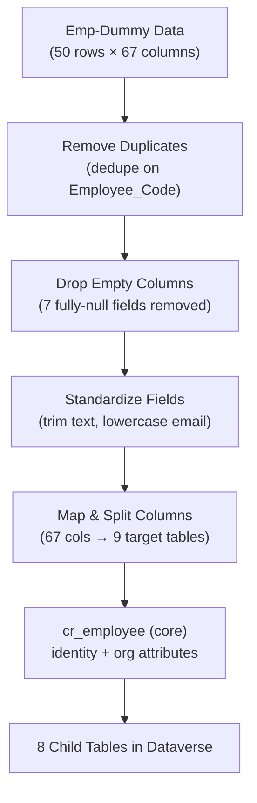

# 🚀 Smarter HR, Powered by Microsoft

### A Unified HR Data & Analytics Ecosystem built on the Microsoft Power Platform

[](https://powerplatform.microsoft.com/)
[](https://learn.microsoft.com/en-us/power-apps/maker/data-platform/data-platform-intro)
[](https://powerbi.microsoft.com/)
[](https://powerautomate.microsoft.com/)
[](https://www.microsoft.com/en-us/microsoft-365/sharepoint/collaboration)
[](#-license)

> **Presented by:** Nupur Pusha · **Client:** ClickTech Retail Private Limited

---

## 📑 Table of Contents

- [Overview](#-overview)
- [Problem Statement](#-problem-statement)
- [The Solution](#-the-solution)
- [Architecture & Workflow](#-architecture--workflow)
- [Data Model — Dataverse ER Diagram](#-data-model--dataverse-er-diagram)
- [Tech Stack](#-tech-stack)
- [Core Components](#-core-components)
  - [Microsoft Dataverse](#1-microsoft-dataverse)
  - [Power BI](#2-power-bi)
  - [Power Automate](#3-power-automate)
  - [Power Apps](#4-power-apps)
  - [SharePoint](#5-sharepoint)
- [Data Cleaning & Validation Pipeline](#-data-cleaning--validation-pipeline)
- [Dashboards & App Screenshots](#-dashboards--app-screenshots)
- [Security & Governance](#-security--governance)
- [Getting Started](#-getting-started)
- [Project Structure](#-project-structure)
- [Results](#-results)
- [Roadmap / AI Ideas](#-roadmap--ai-ideas)
- [Contributing](#-contributing)
- [License](#-license)

---

## 🧭 Overview

**Smarter HR, Powered by Microsoft** is an end-to-end HR data platform that consolidates fragmented employee data from multiple sources (HRMS exports, Excel sheets, SharePoint lists, CSVs) into a **single, governed, relational data model in Microsoft Dataverse** — then layers on **automation, self-service apps, and live analytics** through the Power Platform.

Instead of HR teams manually maintaining disconnected spreadsheets, this project delivers:

- 🗂️ A **centralized, normalized HR database** (Dataverse)
- 🔄 **Automated data ingestion & sync** (Power Automate)
- 📊 **Live, interactive dashboards** (Power BI)
- 📱 A **mobile-friendly HR Portal** (Power Apps)
- 📁 A **secure document hub** (SharePoint)
- 🤖 A foundation ready for **AI-powered HR insights** (Azure OpenAI / Azure ML)

---

## ❗ Problem Statement

### Current HR Data Challenges

| Challenge | Description |
|---|---|
| 🧩 **Fragmented Excel Sheets** | Employee data for ~50 staff across 2 companies lived in disconnected Excel files — no single source of truth, constant version conflicts. |
| 👁️ **Zero Visibility** | HR managers had no dashboards or real-time insights. Decision-making relied on manual reports that were always outdated. |
| 🐢 **100% Manual Processes** | Every data update, notification, and approval was done by hand — time-consuming, error-prone, and completely unscalable. |

---

## 💡 The Solution

### 5 Tools. 1 Unified HR Ecosystem.

Microsoft **Dataverse** sits at the core as the **single source of truth**. Every other tool reads from and writes to it:


| Tool | Role |
|---|---|
| 📊 **Power BI** | Dashboards & analytics on top of Dataverse |
| ⚡ **Power Automate** | Auto-syncs data from source systems into Dataverse |
| 📱 **Power Apps** | Mobile-friendly HR operations & self-service app |
| 📁 **SharePoint** | Secure document hub for HR files & policies |
| 🗄️ **Dataverse** | Centralized, relational, governed HR data model (the core) |

---

## 🏗️ Architecture & Workflow

The platform is organized into **7 layers**, from raw source data to end consumers — with governance and security applied throughout:


**Pipeline stages:**

1. **Source Systems** — HRMS data, SharePoint, Excel, CSV/other files (50 rows × 67 columns of raw employee data)
2. **Automation & Ingestion** — Power Automate handles scheduled triggers, data extraction, validation/logging, error handling, and email alerts
3. **Data Transformation** — Remove duplicates, drop empty columns, standardize fields, map & split columns (67 cols → 9 target tables), run data quality checks
4. **Microsoft Dataverse** — Centralized, scalable HR data model: **1 core table (`cr_employee`) + 8 normalized child tables** = single source of truth
5. **Business Applications** — Power BI (dashboards, KPIs, cohort/trend analysis) and Power Apps (Employee 360 view, data entry, approvals, role-based access)
6. **AI Integration Layer** — Roadmap for HR NL query assistant, attrition risk prediction, employee profile summarizer (Azure OpenAI / Azure ML)
7. **Users & Consumers** — HR stakeholders (managers, analysts, leadership) and an HR chatbot available in Power Apps/Teams

All of this is wrapped in **Governance & Security**: role-based security, data privacy & compliance, audit logs & monitoring, data quality & lineage, and backup & disaster recovery.

### 🔄 Power Automate Sync Flow

Cloud flows continuously watch the Excel/SharePoint sources and Dataverse tables — syncing data and triggering notifications without human intervention:


```
SharePoint / Excel → Trigger → Get File Content → Transform & Cleanse
   → Validate Data → Upsert to Dataverse → Post Processing → Notify
   → Dataverse (9 Normalized Tables) → Power BI / Power Apps / AI Workloads
```

---

## 🗄️ Data Model — Dataverse ER Diagram

The core **`Employee`** table connects to 8 child tables, each capturing a distinct HR domain — enabling clean relational queries without duplication:


| Table | Purpose | Relationship to Employee |
|---|---|---|
| `EMPLOYEE` (core) | Identity & org attributes (code, name, status, level, department, designation, reporting manager) | — |
| `DEMOGRAPHIC` | Gender, DOB, Aadhaar, PAN, personal email | 1 to 1 |
| `ACADEMIC_WORKEX` | LinkedIn ID, highest qualification, total work experience | 1 to 1 |
| `JOINING` | Date of joining, department, designation, official email | 1 to 1 |
| `PERFORMANCE_TA` | Performance ID, last performance rating, promotion type | 1 to many |
| `REWARDS_RECOGNITION` | Rewards/recognition records, given-by | 1 to many |
| `CHANGE_DATA` | Change records, PIP, development plan | 1 to many |
| `EXIT_DATA` | Resignation date, reason, final settlement | 1 to 0 or 1 |
| `PAYROLL` | PF account, bank account details | 1 to 1 |

---

## 🛠️ Tech Stack

| Layer | Technology |
|---|---|
| **Data Platform** | Microsoft Dataverse |
| **Analytics & BI** | Power BI (Desktop + Service) |
| **Automation / ETL** | Power Automate (Cloud Flows, Desktop Flows / RPA) |
| **Application Layer** | Power Apps (Canvas + Model-Driven) |
| **Collaboration & Docs** | SharePoint Online, Microsoft Teams |
| **Identity & Security** | Azure Entra ID (Azure AD), MFA, Conditional Access, RBAC, Row-Level Security |
| **AI / Future Roadmap** | Azure OpenAI, Azure ML |
| **Source Data Formats** | Excel (.xlsx), CSV, HRMS exports |

---

## 🧩 Core Components

### 1. Microsoft Dataverse
*Enterprise-grade cloud database built for the Power Platform — the "single source of truth" core of this project.*

**Core functionalities:**
- 🗃️ **Relational Data Storage** — Structured tables with defined columns, data types, and relationships, like a cloud-native SQL database
- 🔌 **Dataflows & Integration** — Connects to 500+ data sources via Power Query dataflows (SQL, Excel, SharePoint, APIs) in real time
- 🌳 **Environments & Solutions** — Isolated Dev/Test/Prod environments, packaged into deployable Solutions
- 🔐 **Role-Based Access Control** — Security roles at row, column, or table level; data visible only with explicit permission
- 🔍 **Advanced Querying** — FetchXML / OData support for filtering, joins, and aggregation without server-side code
- 📜 **Audit Logs & Versioning** — Every create/update/delete automatically logged with timestamp and user identity

**Why Dataverse?**
- Enterprise Security · Low-Code Integration · Cloud-Native Scale · AI-Ready Platform

**Practical applications:** HR & Employee Records, CRM & Customer Data, Project & Asset Tracking
> *Why it matters: Traditional databases require DBAs. Dataverse is configured by business analysts — no code, full power.*

---

### 2. Power BI
*Turns the Dataverse data model into a star schema purpose-built for fast, flexible analysis.*

**Core functionalities:**
1. Interactive Dashboards
2. Power Query (ETL)
3. DAX Formulas
4. Cross-Report Filtering
5. Publish & Share
6. AI Visuals & Q&A

**HR Analytics Dashboard (live, connected to Dataverse):**


| KPI | Value |
|---|---|
| Total Employees | 50 |
| Active Workforce | 27 |
| Exit Pipeline (FnF) | 23 |
| New Joiners (2025) | 10 |

Visuals include: Headcount by Department, Gender Diversity, Employee Status Mix (Existing / FnF Locked / New Joinee / FnF In Process), Headcount by Grade Level, and Hiring Trend by Joining Year.

**Practical applications:**
- 📈 **Sales Performance Tracker** — live revenue vs. target, pipeline health, deal close rates
- 👥 **HR Workforce Analytics** — headcount trends, attrition rates, hiring velocity, salary distribution
- 📦 **Supply Chain Visibility** — inventory levels, supplier lead times, delivery SLAs with threshold alerts

> *Why it matters: Business users build their own reports. No waiting for IT. Decisions made in the meeting, not after it.*

---

### 3. Power Automate
*Connects Outlook, Excel, SharePoint, Teams, OneDrive, and Dataverse into automated, trigger-based workflows.*

| Feature | Description |
|---|---|
| **Trigger-Based Flows** | Start automatically on new email, form submission, file upload, row added in Dataverse, or scheduled time |
| **Desktop Flows (RPA)** | Record and replay mouse/keyboard actions on legacy apps with no API |
| **Approvals & Notifications** | Email/Teams approval requests with mobile notifications; outcomes logged automatically |
| **Cloud Flows** | Automate cloud-to-cloud workflows across 500+ services (SharePoint, Outlook, Teams, Dataverse, SQL, SAP, Salesforce) |
| **Conditions & Loops** | If/Else branches, Apply-to-Each loops, Do-Until repeats for complex business rules |
| **Error Handling & Retry** | Retry policies, run-after conditions, error branches — flows self-recover on transient failures |

**Practical applications:**
- 🧾 **Invoice Processing** — Email with PDF invoice → AI Builder extracts data → creates Dataverse record → routes to finance for approval
- 👋 **Employee Onboarding** — New hire added in HR system → creates AD account, sends welcome email, assigns SharePoint permissions, schedules onboarding tasks
- ⚙️ **Better Admin** — Dataverse stock field drops below threshold → Teams alert to procurement → raises PO request → logs event with timestamp

**Generic flow pattern:**
```
Trigger Event → Condition Check → Action Executed → Notification Sent → Record Logged
```

---

### 4. Power Apps
*Build apps without writing code.*

| # | Feature | Description |
|---|---|---|
| 01 | **Canvas Apps** | Build custom HR apps with drag-and-drop UI |
| 02 | **Mobile & Responsive Access** | Use apps anytime on web or mobile |
| 03 | **Microsoft Connectors** | Connect with Dataverse, Excel, and Teams |
| 04 | **Power Fx Logic** | Add business rules and automation with low-code formulas |

**HR Portal app (connected live to Dataverse):**


The portal gives HR staff, managers, and employees a friendly interface over the Dataverse tables — KPIs, headcount charts, hiring trends, employee directory, recent announcements, quick actions, and "My Tasks" approvals — **without anyone touching raw data directly**.

> One app definition serves every user — Dataverse security automatically tailors what each person can see and edit based on their role.

**Practical applications:**
- 🏖️ **Leave & Attendance App** — apply and approve leaves digitally in one tap
- 🔍 **Field Inspection App** — capture inspection data with photos and GPS
- 🛒 **Procurement Request App** — raise and track purchase requests digitally

---

### 5. SharePoint
*Secure document hub, tightly integrated with Microsoft 365.*

| Feature | Description |
|---|---|
| 📁 **Document Management** | Store, organize, and share HR files securely |
| 🔐 **Access Control** | Manage user permissions and secure sensitive data |
| 🤝 **Team Collaboration** | Enable real-time collaboration across departments |
| 🔗 **Microsoft 365 Integration** | Connects seamlessly with Teams, Outlook, and the Power Platform |

**Practical applications:**
1. **HR & Onboarding Portal** — centralized HR policies, employee onboarding, and training resources in one secure platform
2. **Secure Document Repository** — contracts and confidential files with role-based access and client data privacy protection
3. **Team Collaboration & Workflow Tracking** — announcements, issue tracking, and automated approval workflows across departments

---

## 🧹 Data Cleaning & Validation Pipeline

Raw HR data (50 rows × 67 columns) goes through a structured cleansing pipeline before landing in Dataverse:



**Key transformations applied:**
- ✅ Removed null, duplicate, whitespace-only, and redundant columns to improve data quality
- ✅ Standardized employee, department, company, and location-related fields for consistency
- ✅ Cleaned and normalized date, status, and reporting manager information across records
- ✅ Identified repeating grouped fields and prepared them for normalization into separate relational tables

---

## 📸 Dashboards & App Screenshots

| Power BI — HR Analytics Dashboard | Power Apps — HR Portal |
|---|---|
|  |  |

| Dataverse ER Diagram | Power Automate Sync Flow |
|---|---|
|  |  |

---

## 🔐 Security & Governance

| Pillar | Implementation |
|---|---|
| **🪪 Identity & Access** | Azure Entra ID (Azure AD) based authentication for secure Single Sign-On (SSO) across Power Apps, Power BI, Dataverse, and Power Automate. MFA and Conditional Access Policies ensure only authorized HR stakeholders can access employee data and workflows. |
| **🛡️ Data Security** | Role-Based Access Control (RBAC), Row-Level Security (RLS), and field-level permissions protect sensitive HR information (payroll, PAN, Aadhaar, banking details). All employee data encrypted at rest and in transit using Microsoft enterprise security standards. |
| **📋 Audit & Compliance** | All user activities, approvals, and workflow changes automatically logged and monitored. Follows Microsoft 365 compliance standards and supports GDPR, DPDP Act, retention policies, and enterprise governance requirements. |
| **⚖️ Governance & Scalability** | Centralized governance policies applied at the Dataverse layer and inherited across Power BI dashboards, Power Apps portals, AI services, and automation workflows — ensuring secure, scalable, consistent HR data management. |

---

## ⚙️ Getting Started

> ⚠️ This project is built entirely on the **Microsoft Power Platform** (low-code/no-code). Setup happens primarily through the Power Platform Admin Center and Maker Portal rather than a traditional codebase.

### Prerequisites
- A Microsoft 365 / Power Platform license (Power Apps, Power BI, Power Automate)
- Access to a **Power Platform environment** with Dataverse enabled
- A **SharePoint Online** site for document storage
- Appropriate **security roles** assigned via Azure Entra ID / Microsoft 365 Admin Center

### Setup Steps

1. **Provision the Dataverse environment**
   - Create a new environment in the [Power Platform Admin Center](https://admin.powerplatform.microsoft.com/)
   - Enable Dataverse for the environment

2. **Import the data model**
   - Create the core `cr_employee` table and the 8 child tables described in the [ER Diagram](#-data-model--dataverse-er-diagram)
   - Configure relationships (1:1, 1:N) as shown in the diagram
   - Set up alternate keys (e.g., `cr_employeecode`) for upsert operations

3. **Run the ingestion pipeline**
   - Configure the Power Automate cloud flow to read from SharePoint/Excel sources
   - Apply the cleansing transforms (dedupe, drop empty columns, standardize, map/split)
   - Upsert cleaned records into Dataverse tables

4. **Connect Power BI**
   - Open Power BI Desktop → Get Data → Dataverse
   - Build the star schema model from the 9 normalized tables
   - Publish the HR Analytics Dashboard to the Power BI Service

5. **Deploy the Power Apps HR Portal**
   - Build/import the canvas app connecting to the Dataverse tables
   - Configure security roles so users only see data relevant to their role
   - Share the app with HR stakeholders (web + mobile via Power Apps mobile)

6. **Configure SharePoint Document Hub**
   - Set up document libraries for HR policies, contracts, and onboarding materials
   - Apply role-based permissions

7. **Apply Security & Governance**
   - Configure Azure Entra ID SSO + MFA + Conditional Access
   - Define RBAC / Row-Level Security roles in Dataverse
   - Enable audit logging and data retention policies

---

## ✅ Results

### One Platform. Zero Data Chaos. Full HR Clarity.

- ✔️ Live Dashboards
- ✔️ Automated Workflows
- ✔️ Mobile HR Access
- ✔️ Secure Document Hub

---

## 🤖 Roadmap / AI Ideas

The architecture's **AI Integration Layer** is designed to plug in the following on top of the existing Dataverse model:

| Idea | Description |
|---|---|
| 💬 **HR Natural Language Query Assistant** | Ask questions about HR data in plain English, get answers from Dataverse |
| 📉 **Attrition Risk Prediction** | Azure ML model to flag employees at risk of leaving based on historical patterns |
| 📄 **Employee Profile Summarizer** | Azure OpenAI-generated summaries of an employee's record (performance, tenure, changes) |
| 🤖 **HR Chatbot** | AI assistant available directly inside Power Apps / Microsoft Teams |

---

## 🤝 Contributing

Contributions, suggestions, and feedback are welcome!

1. Fork this repository
2. Create a feature branch (`git checkout -b feature/your-feature`)
3. Commit your changes (`git commit -m 'Add some feature'`)
4. Push to the branch (`git push origin feature/your-feature`)
5. Open a Pull Request

---

## 📄 License

This project is licensed under the **MIT License** — see the `LICENSE` file for details.

---

<p align="center">
  Built with ❤️ on the Microsoft Power Platform — <b>ClickTech</b>
</p>
